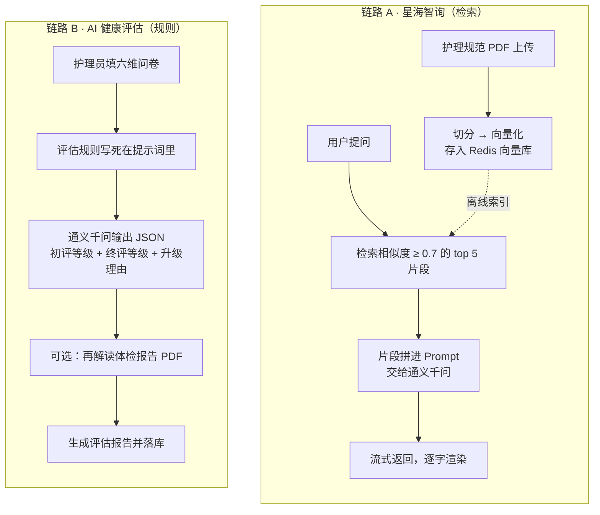
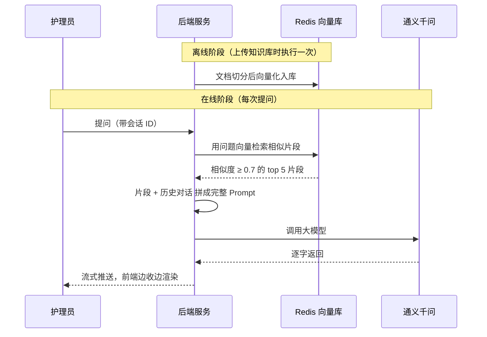
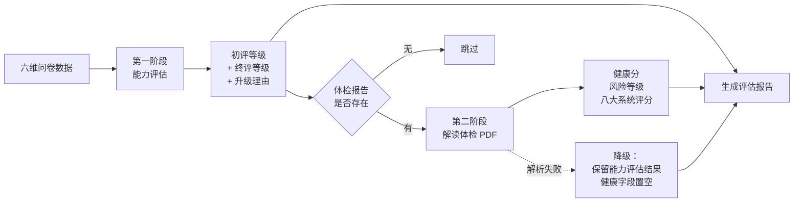

# AI 能力

[← 返回 README](../README.md)

项目里的大模型能力用在**两个互不相干的场景**上，链路设计完全不同。这页讲清楚它们各自解决什么问题、怎么设计的、以及为什么是这么设计的。

> 注意区分两件事：本页讲的是**项目自身的大模型能力**；使用 AI 编程工具辅助开发的过程，见 [AI 辅助开发实践](ai-assisted-dev.md)。

---

## 一、两个场景，两条链路

| | **星海智询**（智能问答） | **AI 健康评估** |
| --- | --- | --- |
| 解决什么 | 护理员找不到机构内部的护理规范 | 老人入住前要定护理等级，人工评定口径不一 |
| 知识从哪来 | **机构自己的文档** → 必须检索 | **民政部的评估标准** → 直接写进提示词 |
| 要不要 RAG | **要** | **不要**（和向量库没关系） |
| 输入 | 自然语言提问 | 结构化问卷（分级、次数） |
| 输出 | 流式文本 | 结构化 JSON（等级 / 评分 / 理由） |
| 会话性 | 多轮，有上下文 | 单次，无上下文 |

**面试高频陷阱**：不要笼统说「项目用 AI 做了 RAG 问答和健康评估」—— 健康评估**没有用检索**，规则是写在提示词里的。把两个场景说成一回事，一问就露。

---

## 二、星海智询：基于知识库的检索增强问答

### 2.1 为什么必须用 RAG，而不是直接问模型

护理员日常会问「卧床老人多久翻一次身」「血糖超标怎么处理」这类问题。直接问通用大模型有两个问题：

1. **它不知道本机构的护理规范** —— 会给出通用但可能与机构规定不一致的答案
2. **答案无法溯源** —— 出问题了不知道依据在哪

RAG 的做法：**先把机构文档向量化存起来，提问时先检索出最相关的片段，再让模型基于这些片段作答**。这样答案有出处，且知识更新只需替换文档，不用重新训练模型。

### 2.2 链路

**为什么要流式**：大模型逐 token 生成，等全文生成完再返回，用户要干等好几秒。流式让首字延迟压到一秒内，体验完全不同。

### 2.3 四个参数的取舍

这四个值不是默认值，是调出来的 —— 也是被追问时最能体现思考的地方：

| 参数 | 取值 | 为什么是这个值 |
| --- | --- | --- |
| 切分粒度 | 500 token / 块，最小 200 字符 | 切太碎语义被割裂，检索到的片段读不懂；切太大则一个块里混了多个主题，相似度被稀释 |
| 相似度阈值 | 0.7 | 低于这个值的片段宁可不给。给了无关内容，模型会基于噪声编答案，比不给更糟 |
| topK | 5 | 兼顾召回覆盖与 Prompt 长度。取太多既费 token 又会让重点被淹没 |
| 嵌入维度 | 1024（text-embedding-v3） | 中文语义表现好，维度适中不至于让向量库膨胀 |

### 2.4 多轮会话怎么隔离（安全点）

每次提问都要带一个**会话 ID**。不加会怎样？—— **所有员工的对话会串进同一段记忆里**：A 问的问题会出现在 B 的上下文里。这是个实打实的信息泄露。

所以会话记忆按 `chat:memory:{会话ID}` 分键存储，一个会话一份，互不干扰。

**记忆为什么要落 Redis 而不是放内存**：
- 进程内存储重启就丢
- 多实例部署时，同一个用户的下一句话可能被路由到另一台机器，内存里找不到上文

### 2.5 检索顾问链

一个问答请求实际串了三个"顾问"，各管一摊：

| 顾问 | 职责 | 去掉会怎样 |
| --- | --- | --- |
| 日志顾问 | 把发往模型的完整 Prompt 记下来 | 答得不对时，查不出到底是检索错了还是模型理解错了 |
| 记忆顾问 | 把历史对话拼进本次请求 | 追问"那第二点呢"时，模型不知道你在说什么 |
| 检索顾问 | 捞相关片段拼进 Prompt | 模型开始编造机构规范 |

---

## 三、AI 健康评估：把评估标准交给大模型执行

### 3.1 业务背景

老人入住前要做能力评估来定护理等级。传统做法是护理员凭经验填纸质量表 —— **主观、口径不一、事后无法追溯依据**。

本项目的做法：把评估标准拆成结构化的规则写进提示词，让大模型按规则执行，输出等级 + 依据理由。

### 3.2 为什么拆成两阶段

**拆开的核心原因**：第二阶段依赖一份 PDF 文件，而这份文件**可能不存在、可能解析失败**。

- 老人没做体检 → 没有 PDF
- PDF 是扫描件 → 文字提取不出来
- 阶段合并成一次调用的话，PDF 这步一挂，**能力等级也一起拿不到** —— 评估员白填一遍问卷

所以设计成**可降级**：第二阶段失败不影响第一阶段结果落库，健康相关的字段留空，由评估员人工补录。

> 这是整个 AI 模块里最能体现工程思维的一处：**AI 调用属于不稳定的外部依赖，必须做异常隔离，不能让它的失败拖垮主业务链路。**

### 3.3 评估规则怎么变成提示词

规则分两组，都来自民政部的老年人能力评估标准：

**第一组 —— 基础分级。** 依据四个维度（日常生活活动、精神状态、感知觉与沟通、社会参与）的分级组合，判定「能力完好 / 轻度失能 / 中度失能 / 重度失能」。例如：

- 能力完好：前三项均为 0 级，且社会参与为 0 或 1 级
- 重度失能：日常生活活动为 3 级；或四项均为 2 级；或日常生活活动为 2 级且其余至少一项为 3 级

**第二组 —— 升级条款。** 在第一组结果上叠加修正：

1. 有认知障碍 / 痴呆 / 精神疾病 → 提高一个等级
2. 近 30 天内发生 2 次及以上跌倒、噎食、自杀、走失 → 提高一个等级
3. 处于昏迷状态 → 直接评定为重度失能
4. **若第一组已判定为重度失能，则不再提高**（封顶规则）

第 4 条是典型的**边界条件**。写漏了会让模型在"重度失能 + 有认知障碍"时给出不存在的更高级别。提示词工程里，边界条件比主干逻辑更容易被忽略。

**让模型同时输出两个等级加一个理由**（初评 / 终评 / 升级理由），目的是**让结果可追溯** —— 评估员能看到"为什么这个老人被升级了"，而不是面对一个黑盒结论。

### 3.4 输出格式的容错

大模型经常不听话：要求输出纯 JSON，它偏偏给你裹一层 markdown 代码块。所以解析前必须做清洗，并在解析失败时兜底。**跟模型打交道，把它的输出当成不可信输入来处理** —— 这是和调普通接口最大的区别。

### 3.5 健康评分的用途

体检报告解读会给出 0–100 的健康指数。系统取 60 分作为**入住建议的阈值**（高于 60 才建议接收）。这个阈值是业务规则，不是模型定的 —— 模型只负责算分，是否接收由机构决定。

---

## 四、工具调用（Function Calling）

项目里定义了一个让模型**直接查询护理项目库**的工具：把查库能力注册给模型，模型在需要时自主调用，用真实数据回答，而不是靠检索猜。

**当前状态**：工具本身已定义，但尚未注册到对话客户端上 —— 也就是说，这条能力**代码写好了但还没启用**，属于下一步规划。

**为什么值得做**：RAG 适合"文档里有答案"的问题，但「现在有哪些护理项目、分别多少钱」这类**结构化数据查询**，检索文档不如直接查库准确。

---

## 五、工程取舍汇总

| 决策 | 取舍理由 |
| --- | --- |
| 模型选通义千问（DashScope） | 养老数据出境有合规要求；且 DashScope 兼容 OpenAI 协议，换模型只改配置不动代码 |
| 向量库用 Redis Stack 而非专用向量数据库 | 复用已有 Redis 运维体系，不用为这个数据量级引入 Milvus / Pinecone 这类重组件 |
| 向量库与业务缓存**分成两个 Redis 实例** | 端口 6378 vs 6379。向量检索依赖 RediSearch 模块，普通 Redis 没有；且两类数据的内存特性与运维口径不同 |
| 会话记忆自己实现而不用框架自带的内存版 | 框架自带的是进程内存储，重启即丢、多实例不一致 |
| 健康评估拆两阶段、第二阶段可降级 | AI 是不稳定外部依赖，不能让它拖垮主业务 |
| 提示词里显式写死输出 JSON 格式 | 大模型默认会输出解释性文字，不约束就无法程序化解析 |

---

相关文档：[技术实现要点](technical-notes.md) · [AI 辅助开发实践](ai-assisted-dev.md) · [功能模块](modules.md)
