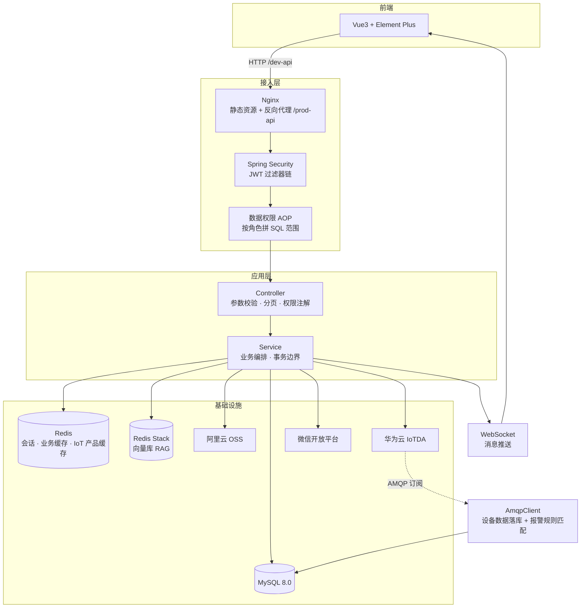

# 架构设计

[← 返回 README](../README.md)

## 为什么是多模块

项目是 Maven 多模块工程（`groupId: com.xhzb`）。选它而不是单模块，是因为要处理两类边界：

- **框架能力与业务能力的边界** —— 权限、缓存、异常、对象存储这些横切能力不应该散落在业务代码里，也不应该在升级框架时被业务改动牵连
- **系统管理域与养老业务域的边界** —— 用户/角色/菜单是通用能力，养老护理是业务能力，两者的改动频率和责任人不同

## 模块划分

| 模块 | 职责 | 依赖方向 |
| --- | --- | --- |
| `xhzb-admin` | 应用入口 `XhzbApplication`；系统级控制器（认证 / 用户 / 角色 / 菜单 / 监控）；多环境配置 | 依赖全部业务模块 |
| `xhzb-common` | 通用能力：`BaseController`、`AjaxResult`、分页封装、异常体系、XSS 过滤、工具类 | 无业务依赖 |
| `xhzb-framework` | 框架核心：Spring Security + JWT 无状态鉴权、数据权限 AOP、**华为云 IoT 客户端** | 依赖 common |
| `xhzb-system` | 系统管理域：用户 / 角色 / 菜单 / 部门 / 字典 / 岗位 | 依赖 framework |
| `xhzb-generator` | 代码生成器：Velocity 模板，一键产出前后端 CRUD | 依赖 common |
| `xhzb-quartz` | 定时任务管理 | 依赖 common |
| `xhzb-oss` | 阿里云 OSS 文件存储 | 依赖 common |
| **`xhzb-nursing-platform`** | **核心业务模块**：床位/楼层/房间、护理等级/计划/项目、老人档案、入住办理、合同、健康评估、知识库、AI 对话、IoT 设备与报警 | 依赖 framework / system / oss |
| `xhzb_ui` | Vue 3 前端（Vite 构建，非 Maven 模块） | — |

> 华为云 IoT 客户端放在 `xhzb-framework` 而非业务模块，是因为它是一个**外部集成的技术能力**（SDK 装配、凭证管理、连接池），与"养老业务规则"无关。业务模块只注入 `IoTDAClient` Bean 调用即可。

## 分层约定

业务模块内统一四层，不跨层调用：

```
com.xhzb.nursing
  ├── controller/   → @RestController，继承 BaseController，统一返回 AjaxResult
  ├── service/      → I*Service 接口
  │     └── impl/   → @Service 实现，承载业务编排与事务边界
  ├── mapper/       → MyBatis-Plus BaseMapper<T> 接口
  └── domain/       → @TableName 实体 + dto/ + vo/
```

配套资源目录：

```
xhzb-nursing-platform/src/main/resources/
  ├── mapper/nursing/   → 手写 XML（复杂查询）
  └── ...
```

**约定要点：**

| 场景 | 约定 |
| --- | --- |
| 列表查询 | Controller 内先调 `startPage()`，再进 Service，由 PageHelper 拦截拼分页 |
| 返回结构 | 一律 `AjaxResult`，禁止直接返回裸实体 |
| 业务异常 | 抛 `ServiceException`（可被全局异常处理器转成友好提示） |
| 集成异常 | 抛 `BaseException`（如华为云 API 报错） |
| 操作审计 | Controller 方法加 `@Log` 注解，写入 `sys_oper_log` |
| 接口鉴权 | `@PreAuthorize("@ss.hasPermi('nursing:xxx:list')")` |

## 请求链路



## 核心数据模型

业务表集中在 `xhzb-nursing-platform`，按业务域分组：

| 业务域 | 表 |
| --- | --- |
| 老人档案 | `elder`、`nursing_elder`（护理员分配）、`family_member`、`family_member_elder` |
| 入退流程 | `check_in`、`check_in_config`、`contract`、`reservation` |
| 院区设施 | `floor`、`room`、`room_type`、`bed` |
| 服务管理 | `nursing_level`、`nursing_plan`、`nursing_project`、`nursing_project_plan`、`nursing_task` |
| 健康评估 | `health_assessment`、`health_assessment_data_collection`、`health_assessment_report` |
| AI 问答 | `knowledge_base`（向量化后存入 Redis Stack） |
| IoT 监测 | `device`、`device_data`、`alert_rule`、`alert_data` |

系统管理表沿用若依的 `sys_user`、`sys_role`、`sys_menu`、`sys_dept`、`sys_dict_*`、`sys_oper_log` 等。

建表脚本：`sql/xhzb.sql`（含结构与种子数据）。

## 关键设计取舍

| 决策 | 取舍 |
| --- | --- |
| 单体多模块，不做微服务 | 养老机构单院区部署，容量远未到需要拆分服务的量级；单体在事务一致性、运维成本、排障效率上都有优势。多模块保证的是**代码边界**，不是部署边界 |
| 权限分两层：接口级 + 数据级 | 只做接口鉴权挡不住"同角色看到别人院区数据"。数据范围用 AOP 在 SQL 层拼条件，避免每个查询手写过滤 |
| 大模型 + RAG，不用全量微调 | 机构内部护理知识更新频繁，微调成本高、迭代慢。RAG 只需替换知识库文档即可更新回答依据，且能给出引用来源 |
| 设备数据走 AMQP 异步，不轮询 | 轮询在设备量上来后开销线性增长，且时效差。AMQP 订阅由 IoT 平台推送，落地即处理 |
| 敏感凭证全部走环境变量 | 配置文件中不出现任何明文密钥，容器启动时注入；避免镜像层与代码历史里残留凭据 |

---

相关文档：[功能模块](modules.md) · [技术实现要点](technical-notes.md) · [部署说明](deployment.md)
