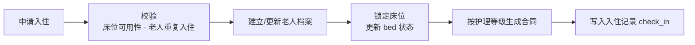
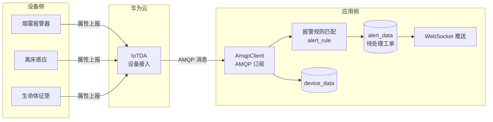
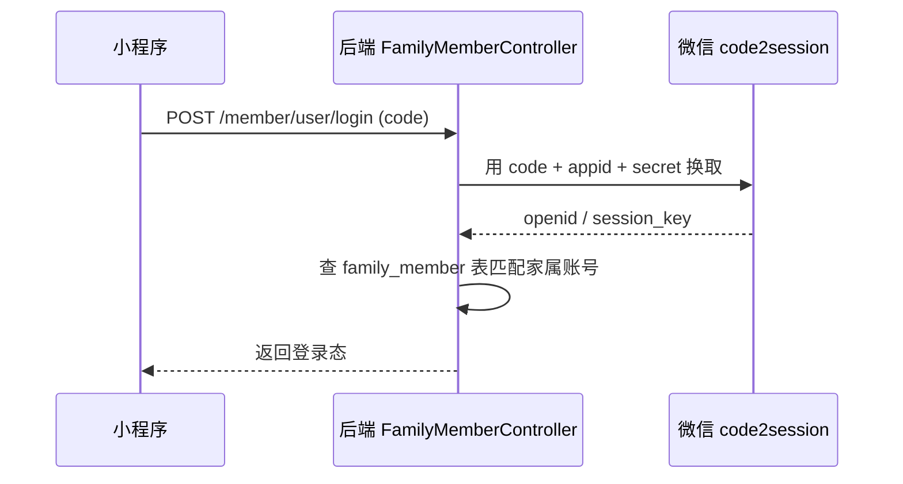

# 功能模块

[← 返回 README](../README.md)

按养老机构实际业务链路排列：**来访 → 入住 → 在住 → 服务 → 退住**，另加 AI 与 IoT 两个智能化模块。

---

## 1. 服务管理

**业务背景**：养老院把照护内容拆成一个个「护理项目」（如协助进食、更换体位、血压监测），再按老人身体状况组合成「护理计划」，而护理等级决定服务频次与收费档位。这三者是排班派工的基础数据。

**主要能力**

| 功能 | 说明 | 接口前缀 |
| --- | --- | --- |
| 护理项目 | 单个照护动作的定义、时长、执行标准 | `/nursing/project/*` |
| 护理计划 | 按等级组合多个项目，形成周期化照护方案 | `/nursing/plan/*` |
| 护理等级 | 等级定义与关联的计划 | `/nursing/level/*` |

**关联表**：`nursing_project`、`nursing_plan`、`nursing_level`、`nursing_project_plan`（多对多中间表）

---

## 2. 入退管理

### 2.1 健康评估（AI 辅助）

**业务背景**：老人入住前需做能力评估，判定护理等级。传统做法是护理员凭经验填写纸质量表，主观性强、口径不统一。

**做法**：把评估拆成六个维度采集结构化数据，再把数据交给大模型，按预设的评估规则生成评估报告与护理建议。

**六维采集数据**

| 维度 | 内容 |
| --- | --- |
| 基本信息 | 姓名、年龄、既往病史等 |
| 健康评估 | 生命体征、慢病情况 |
| 日常生活 | 进食、穿衣、如厕等自理能力 |
| 精神状态 | 认知、情绪 |
| 感知与沟通 | 视力、听力、表达能力 |
| 社会参与 | 社交活动参与度 |

**流程**：采集数据 → 落库 `health_assessment_data_collection` → 调大模型（Prompt 模板见 [docs/api/AI评估API 两个参考的prompt.md](api/AI评估API%20两个参考的prompt.md)）→ 生成 `health_assessment_report`

**接口**：`/nursing/healthAssessment/*`（含 `assessmentData` 触发 AI 评估、`report/{id}` 取报告）

### 2.2 入住办理

**业务背景**：一次入住要同时处理床位、合同、档案、等级四件事，任何一步失败都必须整体回滚，否则会出现"床位占了但没合同"这类脏数据。

**流程（单事务内完成）**



**接口**：`POST /nursing/checkIn/apply`

### 2.3 来访预约

**业务背景**：家属参观前先预约，机构据此预留床位或房间，避免到店无房。

**接口**：`/nursing/reservation/*`；入住配置 `/nursing/checkInConfig/*`

---

## 3. 在住管理

| 功能 | 说明 | 接口前缀 |
| --- | --- | --- |
| 老人档案 | 基础信息、健康档案的维护与检索 | `/nursing/elder/*` |
| 护理员分配 | 为老人指定负责的护理员 | `/elder/nursingElder/*` |
| 家属绑定 | 家属账号与老人的关联关系 | `/nursing/familyMember/*`、`/nursing/familyMemberElder/*` |
| 智能床位视图 | 按楼层查看房间与床位占用，并叠加上设备实时状态 | `/elder/floor/getAllFloorsWithDevice`、`/elder/room/getRoomsWithDeviceByFloorId/{floorId}` |

> 智能床位是「在住」与「IoT」两个模块的交汇点：床位视图不仅显示占用状态，还把该床位绑定的设备（如离床感应、生命体征垫）的实时读数一并带出，护理员在一个界面就能同时看到"谁住在这、床位是否空、设备是否报警"。

---

## 4. 星海智询（AI 智能问答）

**业务背景**：护理员日常会问"卧床老人多久翻一次身""血糖超标怎么处理"这类问题，答案在机构内部的护理规范文档里，但没人会去翻。需要一个能基于**本机构知识库**回答的助手。

**为什么用 RAG 而不是直接问大模型**：通用大模型不知道本机构的护理规范，回答会"编"。RAG 先把机构知识库文档向量化存起来，提问时先检索出最相关的片段，再让大模型基于这些片段作答。

**实现**

| 环节 | 做法 |
| --- | --- |
| 知识库管理 | 上传/维护护理知识文档，落库 `knowledge_base` |
| 向量化 | `text-embedding-v3` 生成 1024 维向量，存入 Redis Stack |
| 切分策略 | 500 token 分块，最小 200 字符，避免语义被切碎 |
| 检索 | `RedisVectorStore` + `QuestionAnswerAdvisor`，相似度阈值 0.7，topK = 5 |
| 多轮记忆 | `MessageChatMemoryAdvisor` + Redis 持久化的 `RedisChatMemoryService` |
| 输出 | 流式返回（WebFlux），前端逐字渲染 |

**接口**：`POST /ai/chat`（流式）、`/ai/history*`（会话历史）、`/nursing/knowledgeBase/*`（知识库 CRUD 与上传）

---

## 5. 智能监测（IoT）

**业务背景**：养老院最怕的是夜间老人跌倒、离床、卫生间滞留无人发现。靠护理员定时巡房覆盖不到，需要设备持续监测 + 异常自动报警。

**架构**



**设备管理**

| 功能 | 说明 |
| --- | --- |
| 产品同步 | 从 IoT 平台拉取产品列表，缓存于 Redis `iot:all_product_list` |
| 注册设备 | 调华为云 API 创建设备，再落库 `device` |
| 绑定位置 | 支持三种场景：随身设备、房间固定设备、床位设备 |
| 设备详情 | 本地库信息与华为云实时状态合并返回 |

**报警规则引擎**

规则不是简单的"超过阈值就报"，而是五元组匹配：

```
功能标识 + 运算符 + 阈值 + 持续周期 + 聚合周期
```

- **持续周期**：解决抖动——心率瞬时冲到 120 不该报警，持续 5 分钟才报
- **聚合周期**：解决统计口径——"过去 10 分钟的平均值超过阈值"

命中后写入 `alert_data`，带报警原因、处理状态、处理人与处理时间，形成可闭环的工单。

**接口**：`/nursing/device/*`、`/nursing/data/list`、`/nursing/alertRule/*`、`/nursing/alertData/*`

---

## 6. 小程序端（家属端）

**业务背景**：家属希望随时查看老人在院情况、预约探视、查询服务项，装 App 成本太高，用微信小程序最轻。

**登录流程**



**已实现接口**：微信登录、家属预约查询与取消、护理项目分页查询等，前缀 `/member/*`。

---

相关文档：[架构设计](architecture.md) · [技术实现要点](technical-notes.md) · [部署说明](deployment.md)
